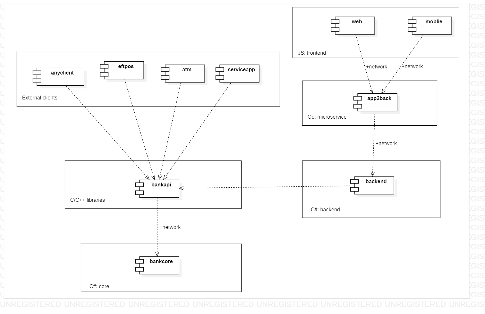

# banking 

`banking` is a C# project for imitating payment system. 

Documentation: 

- Overall desciption of the project: [ODT](docs/odt/PaymentSystem.odt) and [PDF](docs/pdf/PaymentSystem.pdf) versions; 
- MDJ files for designing the app ([models](docs/mdj/models.mdj)) - use StarUML for viewing and editing. 

## Architecture 

Modules:



Server gets JSON an an input and parses it as a C# class: 
```C#
public class Operation
{
    // 
}
```

## How to contribute  

To be continued... 
